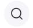
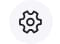

<html lang="pt-br">
<head>
    <meta charset="UTF-8">
    <meta name="viewport" content="width=device-width, initial-scale=1.0">
    <link rel="stylesheet" href="arte.css">
    <title>MUNDO ARTE</title>
</head>
<body>
    

        

            
        

        

            

                <h1>IMAGENS</h1>
            

            

                <h1>ARTES</h1>
            

            

                <h1>QUADROS</h1>
            

            

                <h1>NOTÍCIAS</h1>
            

        

        

            
            

                
            

        

        

            

                <input type="button" value="ENTRAR" id="buton_etn">
            

            

                <input type="button" value="PARTICIPE" id="buton_par">
            

        

    

    

        

            

                
Bem-vindo ao MundoArte. Sua melhor fonte de
                    notícias sobre o mundo da arte!

            

            

                <input type="button" value="Participe do MundoArte" id="buton1">
            

        

    

    

    

        

            <h1>@MUNDOARTE</h1>
        

        

            
GMAIL: mundoarteofc@gmail.com

            

CONTATO: (89) 3815-5161

        

    

</body>
</html>
